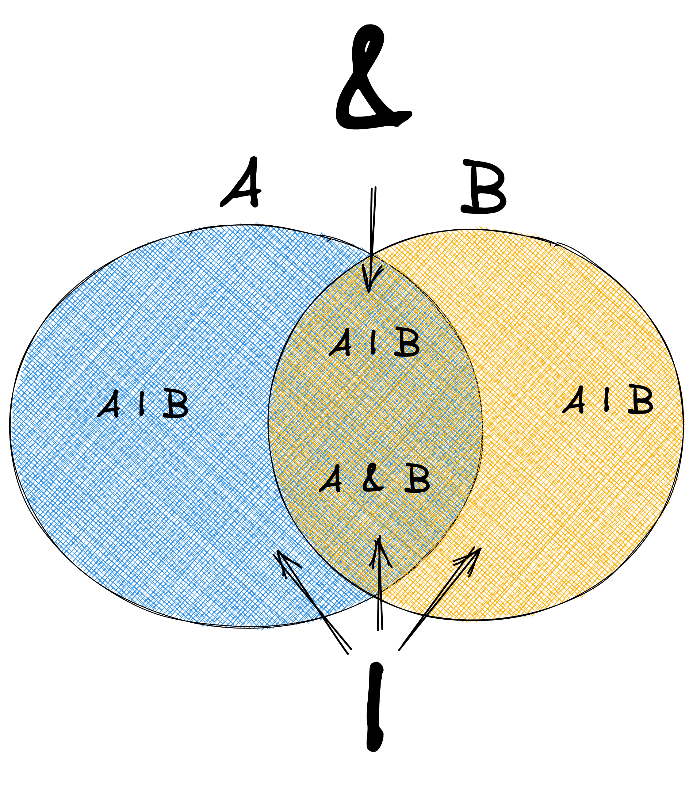

# Motivation

While running trainings, consulting services and audits, it turns out sometimes that developers would like to systematize their TypeScript knowledge. This post aims to serve exactly this.

It includes a list of important features and concepts coming directly from the TypeScript language or strictly related to TypeScript language. Each definition is very brief, yet illustrated with a clear code sample. Descriptions are optimized to be understood as quick as possible 😉.

----

# Mapped types

TypeScript **mapped types** create new types by transforming properties of an existing type, usually by using the `keyof OBJ` operator (built-in: `Partial`, `Required`, `Readonly`, `Pick`) - or by creating new object types (`Record`). By creating one type on top of another one, mapped types help to create a single source of a type structure, and therefore updating the source type is automatically reflected in all derivative types.

```ts
// all the built-in mapped types:
type Partial<T> = { [P in keyof T]?: T[P]; };
type Required<T> = { [P in keyof T]-?: T[P]; };
type Readonly<T> = { readonly [P in keyof T]: T[P]; };
type Pick<T, K extends keyof T> = { [P in K]: T[P] };
type Record<K extends keyof any, T> = { [P in K]: T; };

// and the example

interface Booking {
    roomType: string;
    fee: number;
    dueDate: string;
    numberOfGuests: number;
}

type BookingSummary = Pick<Booking, 'roomType' | 'fee'>;

const summary: BookingSummary = {
    roomType: "Deluxe",
    fee: 250,
};
```

## Homomorphic Mapped Types

TypeScript **homomorphic types** in are a specific kind of mapped type that preserve the structure and modifiers (i.e. `readonly`, property being *optional*) of the original type while allowing for transformations on its properties. Mapped types are homomorphic whenever this pattern is used: `{ [ K in keyof T ]: U }` (where `T` is a type parameter) - a new type is built on top of the structure of an existing type. An example of a non-homomorphic type is: `Record<K extends keyof any, T> = { [P in K]: T;
};` - there's no iteration over the keys of an existing object type, and hence, there's no way for TS to preserve the modifiers.

```ts
interface Booking {
    roomType: string;
    fee: number;
    readonly dueDate?: Date;
    numberOfGuests?: number;
}

// homomorphic:
type OptionalBooking = Partial<Booking>
// type OptionalBooking = {
//     roomType?: string | undefined;
//     fee?: number | undefined;
//     readonly dueDate?: Date | undefined; ✅ readonly preserved
//     numberOfGuests?: number | undefined;
// }
type ReadonlyBooking = Readonly<Booking>
// type ReadonlyBooking = {
//     readonly roomType: string;
//     readonly fee: number;
//     readonly dueDate?: Date | undefined; ✅ optional preserved
//     readonly numberOfGuests?: number | undefined; ✅ optional preserved
// }
type PickedBooking = Omit<Booking, 'fee'>
// type PickedBooking = {
//     roomType: string;
//     readonly dueDate?: Date | undefined; ✅ readonly/optional preserved
//     numberOfGuests?: number | undefined; ✅ optional preserved
// }

// NOT homomorphic
type Keys = keyof Booking
type AnotherBooking = {
  [K in Keys]: Booking[K]
}
// type AnotherBooking = {
//     fee: number;
//     roomType: string;
//     dueDate: Date | undefined; ❌ readonly lost, optional property lost
//     numberOfGuests: number | undefined; ❌ optional property lost
// }
// (*) ❌ optional property lost - the property allows undefined value
// but the property as-is has to exist (which is not the case with optional props)
```


❌ Reverse Mapped Types
❌ Distributive mapped types

```ts
// https://ducin.dev, https://www.youtube.com/@DucinDev

type Cat = {
  name: string
  meow(): void
}
type Dog = {
  name: string
  bark(): void
}

type Animals = Cat | Dog
type AnimalsWithoutName = Omit<Animals, 'name'>
//   ^?

type KeysOfAnimals = keyof Animals
//   ^?

type DistributiveOmit<T, K extends PropertyKey> = T extends T ? Omit<T, K> : never
type DistributiveAnimalsWithoutName = DistributiveOmit<Animals, 'name'>
//   ^?
```

See [this video](https://www.youtube.com/watch?v=98sHsvFf6YI&list=PLr2xHVWDKMvxhQmJcax4kO1p5pq7nvjX5&index=15).

# Type inference

TypeScript's **type inference** allows the compiler to automatically deduce the types of variables, function parameters, and return values based on their assigned values or context, eliminating the need for explicit type annotations. Some of the usecases are very straightforward, however, some others can seem cryptic, even for seasoned TypeScript users. While type inference is generally preferred (especially because of automatic flow of types), explicit type annotations are beneficial when declaring public APIs, reducing implicit `any` occurrences or simply during development (to verify one's code against explicit annotations)

```ts
// compare the two:
let letCurrency = 'USD' // string
const constCurrency = 'USD' // 'USD'

// and the two also:
const constPayment = {
  amount: 125, // number
  currency: 'USD' // string
}

type Currency = 'USD' | 'GBP' | 'EUR' | 'PLN'
type Tax = 0 | 0.05 | 0.08 | 0.23
const explicitCurrency: Currency = 'USD'
let explicitAmount: Tax = 0.05

let explicitPayment = {
  amount: explicitAmount, // 0.05
  currency: explicitCurrency // 'USD'
}

// or this one:
var obj = {}
obj.property = 'value' // ❌ error: Property 'property' does not exist on type '{}'

```

❌ Structural vs nominal typing
❌ Structural Polimorphism

❌ Top and bottom types 
❌ Compile time vs runtime 

## Literal types

TypeScript **literal types** allow you to specify exact values that an expression can hold, enhancing type safety by restricting possible values. This can be useful for defining specific states, configurations or domain-specific values within your application.

```ts
type BookingStatus = 'pending' | 'confirmed' | 'canceled';
// as compared to:
type BookingStatus_nonLiteral = string

type AcceptedCoins = 1 | 2 | 5 | 10 | 20 | 50
```

## Intrinsic Types

TypeScript **intrinsic types** are built-in types that provide functionality for manipulating other types at a fundamental level - they are supported at the compiler level, but are lacking TypeScript syntax to express them as all other types. They are often used for transforming string literals and other types without needing to define custom logic.

```ts
type Currency = 'USD' | 'Eur' | 'pln';

// type Uppercase<S extends string> = intrinsic
type UppercaseCurrency = Uppercase<Currency>; // Result: 'USD' | 'EUR' | 'PLN'

// type Lowercase<S extends string> = intrinsic
type LowercaseCurrency = Lowercase<Currency>; // Result: 'usd' | 'eur' | 'pln'
```

## Type Alias

TypeScript **type aliases** allow you to create a new name for any existing type (whatever it is - primitive, object, literal, union etc). They improve code readability and maintainability, especially when used consistently across the codebase - their alias declaration becomes the only place to update, if the type changes.

```ts
// instead of:
type Payment = {
  fee: number
}

// try this:
type Money = number
// and use Money alias consistently:
type Payment = {
  fee: Money
}

// and whenever you need to extend/change what Money is:
type Money = {
    amount: number
    currency: Currency
}
// you change the type only in this one place.
// all type usage updates automatically:
type Payment = {
  fee: Money // { amount: number; currency: Currency }
}
```

## Brand/opaque types

A TypeScript **brand type** (or **branded type**, or **opaque type**) allows you to create distinct types from existing types by adding a unique identifier, or "brand," to them. Essentially, this allows to hijack TypeScript's structural typing nature in order to create "special" brands of primitives, which are disjoint, due to coming from a different brand. Worth noting, that the "additional property" is artificial and it's declared only for the purpose of the compiler - it will never exist in runtime whatsoever.

```ts
type Money = number
type ID = number

let money: Money = 1.99
let id: ID = 23496793245

// 😥 unfortunately, both compile, since the technical type is the same
// but their meaning is completely different
money = id
id = money

// create brands:
type ID_brand = number & { __brand: 'ID' };
type Money_brand = number & { __brand: 'Money' };

declare let id_brand: ID_brand
declare let money_brand: Money_brand
// both error in compile time
money_brand = id_brand
id_brand = money_brand
```

# Annotations and Assertions

## Type annotation

A TypeScript **type annotation** allows you to explicitly specify the type of a variable, function parameter, or return value. This ensures type safety by enforcing that values assigned to the variable conform to the specified type.

```ts
type Money = { amount: number }
type Currency = 'USD' | 'EUR' | 'PLN';
type MoneyWithCurrency = { amount: number; currency: Currency }

let money1: Money = { amount: 150 } // ✅ compiles, as expected

let money2: MoneyWithCurrency = { amount: 150 } // ❌ error, as expected

let money3: MoneyWithCurrency = { amount: 150, currency: 'USD' } // ✅ compiles, as expected
```

## Type assertion

A TypeScript **type assertion** is a way to tell the TypeScript compiler to treat a variable as a specific type, overriding its inferred type (or how I prefer to explain it: "_shut up, TypeScript, I know better than you what this type is! 🔥_"). This can be useful for:
- upcasting - where the assertion is always type-safe, as the expressions become more abstract - we limit the knowledge about a type (we can't be wrong when limiting knowledge), or
- downcasting - where it may not be type-safe, as the expression becomes more specific - we extend the knowledge. It's not always type-safe, as we could extend the type with properties that might not exist in runtime. It could be right, but it doesn't have to

```ts
type Money = { amount: number }
type Currency = 'USD' | 'EUR' | 'PLN';
type MoneyWithCurrency = { amount: number; currency: Currency }

// upcasting - always correct
// ✅ compiles
let money1 = { amount: 150, currency: 'USD' } as Money

// downcasting - correct or not; OFTEN NOT
// 🤯 also compiles
let money2 = { amount: 150 } as MoneyWithCurrency
```

## Const assertion

TypeScript **`const` assertion** allows you to create immutable types by inferring the most specific literal types for arrays and objects. This ensures that certain values remain constant and cannot be changed. These make sense only when a literal is created, as TypeScript needs to figure out the literal types from exact values and/or object shape.

```ts
// type: string[]
const supportedCurrencies = ['USD', 'EUR', 'PLN'];

// type: readonly ["USD", "EUR", "PLN"]
const supportedCurrencies_asConst = ['USD', 'EUR', 'PLN'] as const;

// type: {
//     roomType: string;
//     fee: number;
//     dueDate: string;
//     guests: string[];
// }
const booking = {
    roomType: "Deluxe",
    fee: 250,
    dueDate: "2024-12-01",
    guests: ['john', 'annie'],
};

// type: {
//     readonly roomType: "Deluxe";
//     readonly fee: 250;
//     readonly dueDate: "2024-12-01";
//     readonly guests: readonly ["john", "annie"];
// }
const booking_asConst = {
    roomType: "Deluxe",
    fee: 250,
    dueDate: "2024-12-01",
    guests: ['john', 'annie'],
} as const
```

Type space vs value space
Excessive property check


# Type guard

A TypeScript **type guard** is a function or conditional statement that checks the type of a variable at runtime. This allows the TypeScript compiler to narrow down the type and provide more specific type information within different code branches. Type guards improve code safety and prevent runtime errors by ensuring that operations are performed only on compatible types.

```ts
class RoomBooking {
    constructor(
        private type: string,
        private roomType: string,
        private fee: number,
        private numberOfGuests: number
    ){}
}

type UnconfirmedReservation = {
    reservationCode: string;
    requiredPayment: number;
}

type ReservationCode = string

type Booking = ReservationCode | UnconfirmedReservation | RoomBooking

declare const booking: Booking

if (typeof booking === 'string') {
    booking // type: string == ReservationCode
} else if (booking instanceof RoomBooking) {
    booking // type: RoomBooking
} else {
    booking // type: UnconfirmedReservation
}
```

## Type predicate

A TypeScript **type predicate** is a syntax construct following the pattern `parameterName is Type` which is used in both custom type guards and assertion functions. Runtime-wise type predicate boils down to a boolean value, but compile-time-wise it allows TypeScript to either narrow down the type of an expression within an if statement/ternary expression (custom type guard) or to assert the type of an expression (assertion function)

```ts
// given some types
type Booking = {...}
type RoomBooking = {...}

// type predicate:
function isRoomBooking(booking: Booking): booking is RoomBooking {
    //...
}
function assertRoomBooking(booking: Booking): assert booking is RoomBooking {
    //...
}

// NOT a type redicate
function isRoomBooking(booking: Booking): boolean {
    //...
}
```

## Assertion function

TypeScript assertion functions are specialized functions that validate conditions at runtime and inform the TypeScript compiler about the expected types of variables. When an assertion function is called, it checks a specified condition, and if the condition fails, it throws an error; otherwise, TypeScript narrows the type of the variable for subsequent code execution.

```ts
// 3 members of a Booking Union
type HotelBooking = {
    type: 'hotel';
    roomType: string;
    fee: number;
    dueDate: string;
};

type FlightBooking = {
    type: 'flight';
    airline: string;
    ticketPrice: number;
    departureDate: string;
};

type CarRentalBooking = {
    type: 'car';
    carModel: string;
    rentalFee: number;
    rentalStartDate: string;
};

type Booking = HotelBooking | FlightBooking | CarRentalBooking;

// Assertion function to ensure the booking is of a specific type
function assertIsBookingOfType<T extends Booking, BookingType extends Booking['type']>(booking: Booking, type: BookingType): asserts booking is T & { type: BookingType } {
    if (booking.type !== type) {
        throw new Error(`Invalid booking type: expected ${type}, but got ${booking.type}`);
    }
}

// usage
declare const booking: Booking; // Booking here
assertIsBookingOfType(booking, 'hotel'); // error thrown in runtime if not HotelBooking
booking // ❤️‍🔥 HotelBooking 
```

❌ # Index signature

Assignable to
Covariance...
Widening
Narrowing
Evolving
type vs interface
Literal
String literal union

# Unions

TypeScript **union types** allow a variable to hold values of multiple types, enabling flexibility in data handling. This is particularly useful when a value can be one of several types.

```ts
type BookingId = string | number;

let bookingId: BookingId
bookingId = 12345; // ✅ OK
bookingId = "B123"; // ✅ OK
bookingId = true; // ❌ Error
```

❌ ## Distributivity of Unions

See [this video](https://www.youtube.com/watch?v=abiONRrw1A0&list=PLr2xHVWDKMvxhQmJcax4kO1p5pq7nvjX5&index=13).

## Discriminated union

A discriminated union allows you to define a type that can be one of several different types, each distinguished by a common property. This common property is referred as _discriminant property_.

```ts
interface RoomBooking {
    type: "room";
    roomType: string;
    fee: number;
    numberOfGuests: number;
}

interface UnconfirmedReservation {
    type: "unconfirmed";
    reservationCode: string;
    requiredPayment: number;
}

type Booking = RoomBooking | UnconfirmedReservation; // or more

const roomBooking: Booking = {
    type: "room",
    roomType: "Deluxe",
    fee: 250,
    numberOfGuests: 2,
}; // ✅ OK

const unconfirmedReservation: Booking = {
    type: "unconfirmed",
    reservationCode: "ABC123",
    requiredPayment: 100,
}; // ✅ OK
```

## Discriminant property

A TypeScript **discriminant property** is a shared property in a *discriminated union* that helps TypeScript determine the specific type being used. This property typically has a literal type and it's the one explicitly verified in *type guards* (e.g. `if (obj.type === ___`)).

```ts
interface RoomBooking {
    type: "room"; // discriminant property
    roomType: string;
    fee: number;
    numberOfGuests: number;
}

interface UnconfirmedReservation {
    type: "unconfirmed"; // discriminant property
    reservationCode: string;
    requiredPayment: number;
}

type Booking = RoomBooking | UnconfirmedReservation;

declare const booking: Booking

if (booking.type === "room"){
    booking // type: RoomBooking
} else {
    booking // type: UnconfirmedReservation
}

```

# Intersections

TypeScript **intersection types** allow you to combine multiple types into one, requiring an object to satisfy all included types. This is useful for creating complex types that need to share properties from multiple sources.

```ts
interface Booking {
    roomType: string;
    fee: number;
    dueDate: string;
    numberOfGuests: number;
}

interface HasRebate {
    rebateAmount: number;
}

type BookingWithRebate = Booking & HasRebate;

// Usage
const booking: BookingWithRebate = {
    roomType: "Deluxe",
    fee: 250,
    dueDate: "2024-12-01",
    numberOfGuests: 3,
    rebateAmount: 20, // Rebate applied to the booking
};
```

## Empty Intersection

**Empty Intersection** refers to a situation in TypeScript where the intersection of two types results in a type that has no possible values. The resulting type gets reduced to `never`, as the type cannot be instantiated. Such situation happens for either different types of primitives (e.g. `string & number`) or object types with at least one common property with exclusive value types.

```ts
interface DeluxeRoom {
    roomType: "Deluxe";
    maxGuests: number;
}

interface BudgetRoom {
    roomType: "Budget";
    maxGuests: number;
}

type Impossible = DeluxeRoom & BudgetRoom // never

// Type '{}' is not assignable to type 'never'.
//   The intersection 'Impossible' was reduced to 'never'
//... because property 'roomType' has conflicting types in some constituents.
const impossible: Impossible = {}
```

Module augmentation

Keywords:
extends
as
infer


Generics
Type parameter
Const type parameters
Generic constraint
Constant generics

# Generic Constraint

A TypeScript **generic constraint** restricts the types that can be used as type parameters, ensuring that only types that meet specific criteria can be passed. This is useful for enforcing certain properties or methods on the generic type. While using a generic constraint, the compiler has more knowledge e.g. while creating a utility type and it can make more assumptions (such as that a certain property over `T` exists).

See [this video](https://www.youtube.com/watch?v=6fSb5kGc1BI&list=PLr2xHVWDKMvxhQmJcax4kO1p5pq7nvjX5&index=14).

❌ # Object types

See [this video](https://www.youtube.com/watch?v=gzCyI5dv_Tg&list=PLr2xHVWDKMvxhQmJcax4kO1p5pq7nvjX5&index=4).

❌ ## Uppercase `Object` type

❌ ## Lowercase `object` type

❌ ## Literal `{}` type

# Tuples

A TypeScript **tuple** is a typed array that allows you to store a fixed number of elements with specific types. Unlike arrays, tuples' length and index access is type-safe. The major downside is that in many cases we're dealing with dynamic data structures and often we might not know the array length in compile-time.

```ts
type BookingTuple = [string, number, number]
let booking: BookingTuple = ["2024-12-01", 150, 2]; // [dueDate, fee, numberOfGuests]
```

See [this video](https://www.youtube.com/watch?v=5dqI9YY9j54&list=PLr2xHVWDKMvxhQmJcax4kO1p5pq7nvjX5&index=7).

## Named Tuple

A TypeScript **named tuple** enhances the readability of your code by allowing you to assign names to the elements in the tuple. This provides context for what each index represents.

```ts
type BookingNamedTuple = [dueDate: string, fee: number, guests: number]
const booking: BookingTuple = ["2024-12-01", 150, 2];
```

## Variadic Tuple

A TypeScript **variadic tuple** allows you to create tuples that can accept a variable number of elements of different types. This is particularly useful for scenarios where the number of guests can vary.

```ts
type NonEmptyArray<T> = [T, ...T[]];

type Guest = {
  id: string
  name: string
}
type RoomGuests = NonEmptyArray<Guest>; // at least 1 guest

// ❌ Error: Type '[]' is not assignable to type 'RoomGuests'.
let noGuests: RoomGuests = [];

// ✅ ok
let oneGuest: RoomGuests = [{ id: 'xxxx-xxxx', name: "john" }];
```

See [this video](https://www.youtube.com/watch?v=x2VWMHgA_fw).

# Venn Diagrams

[Venn diagrams](https://en.wikipedia.org/wiki/Venn_diagram) can effectively illustrate relationships between types in TypeScript, such as unions, intersections, and subtypes. Union types, represented by the pipe symbol (|), can be visualized as the combined area of two circles, where the resulting set includes all members from both types. In contrast, intersection types, denoted by the ampersand (&), correspond to the overlapping area of the circles, representing only those members that belong to both types simultaneously

